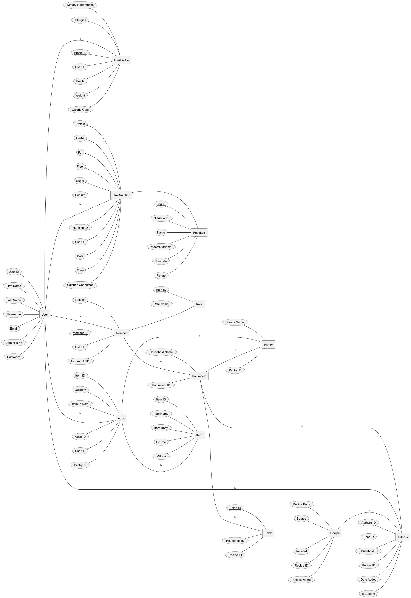

Database Outline
=====================================

KMS runs on a postgreSQL backend server.
Below is a object diagram for the database, along with the schema for each item 

.. autosummary::
   :toctree: generated/

   db.schema.adds
   db.schema.authors
   db.schema.holds
   db.schema.household
   db.schema.item
   db.schema.join_request
   db.schema.member
   db.schema.recipe
   db.schema.role
   db.schema.user_nutrition
   db.schema.user_profile
   db.schema.user

